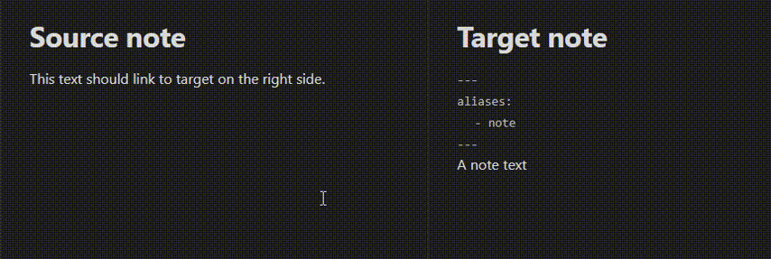
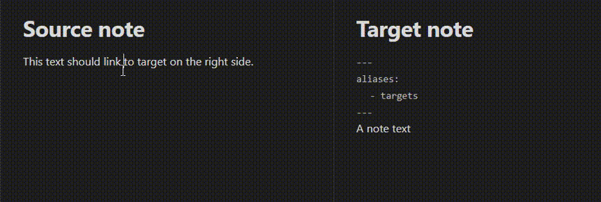

# Link with alias

 

This plugin implements these commands

-   Create link with alias - provides fast creation of link whose display text is added into aliases atribute in front matter of the target note.
-   Create link - provides fast creation of link
-   Toggle link display text - toggles display text (alias) of the just edited link.

Both `Create link` commands assures that link display text is kept => isn't replaced by Obsidian link autocompletion.

# Use cases

## Make link on existing text

User selects some text and runs the command "Create link with alias". The command creates a new link with target and display name copied from selected text and opens the link autocompletion popup and ...

A) ... user can just select a value from the autocompletion popup, press Enter and link and alias are created.

B) ... user can edit the link target then select a value from the autocompletion popup, press Enter and link and alias are created. Note that link text is kept.

C) ... user can enter name of new note, let cursor leave the link, then the new note is created automatically with link display text as alias.

## Add alias for existing link

User puts cursor into existing link and runs command "Create link with alias". The command creates the target document, if it doesn't exist, and adds link display text as alias into front matter of the target note

## Make completely new link

User puts cursor into text and runs command "Create link with alias". It creates link brackets and opens autocompletion popup for entering of link target name. After user types in part of the target name or alias and selects it by enter, the link is created. If there is no display text and user moves back into link and enters one, then system detects it and after cursor leaves the brackets or user closes the window, the link display text is added as alias into front matter of the target note. While this use case is supported, it is usually faster to write text without link first and then **Make link on existing text**.

## Toggle link display text

As long as rename of Note has to keep the text with link to note understandable, it is good idea to keep the link display text in the link. In such case the Note is renamed but link display text stays unchanged. That is wanted behavior in many cases.
But in case you have just list of Notes, where you want to see current note name, then the link display text is not helpful. The "Toggle link display text" command is a fast way how to remove unwanted display text and to keep just plain link.

# Settings

You can configured whether

A) the text which is selected when command is executed is copied as link target name, so the autocompletion can immediatelly offer the similar term

B) or the link target is kept empty so you can immediatelly type in the target note name

# Notes

-   The alias is added into front matter of the target note only when it isn't there yet
-   The aliases are sorted from longest to shortest, so the Obsidian backlinks are detected correctly
-   The link autocompletion popup is the standard one provided by Obsidian. It sometime replaces the link text automaticaly, but it isn't wanted in this use case. The action "Create link with alias" will keep the link text exactly the same like it was before.

# About me

I am a Software developer and architect with more then 35 years of programming experience. I am highly interested in creation and maintenance of human understandable, up to date, distributed and trustworthy knowledge.

I love lifetime, nature, people, psychology and dancing. I am exited about the Obsidian because it helps me to experiment, prototype and prepare concepts of that knowledge base.

Thank You for Your support which helps me to give more time for Obsidian plugins and that Knowledge base project I am dreaming of.

